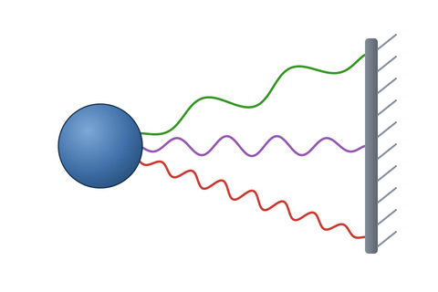
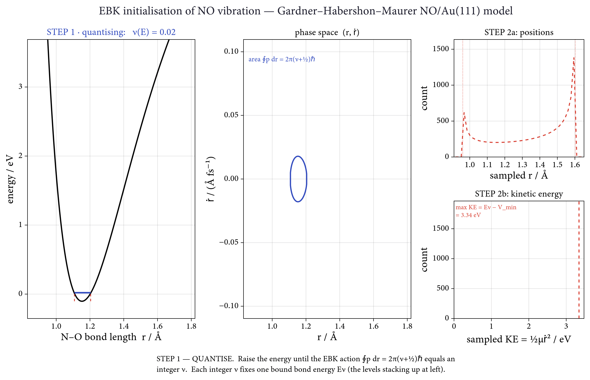

<p align="center">
  <picture>
    <source media="(prefers-color-scheme: dark)" srcset="assets/logo-dark.gif"/>
    
  </picture>
</p>

<h1 align="center">MemoryElectronicFriction.jl</h1>

<p align="center">
  <a href="https://github.com/Louhokseson/MemoryElectronicFriction.jl/actions/workflows/CI.yml">
    
  </a>
  
  
  
  <a href="https://doi.org/10.48550/arXiv.2608.12572">
    
  </a>
</p>

<div align="center">
  <h3>Memory-Dependent Electronic Friction from Anderson Impurity Models</h3>
</div>

---

<p align="justify">
<strong>MemoryElectronicFriction.jl</strong> computes the frequency-dependent (memory) electronic friction kernel 
$\mathcal{K}(\omega;x)$ experienced by nonadiabatic molecular adsorbates on metal surfaces, from Anderson impurity 
and Newns–Anderson models. The package implements memory-dependent (non-Markovian) friction following the theory of 
<a href="https://doi.org/10.48550/arXiv.2608.12572">Lu <em>et al.</em> (2026)</a>, 
together with its Markovian ($\omega \to 0$) limit, and provides the surrounding infrastructure 
— adsorbate models, discretised electronic baths, and molecular-dynamics workflows — 
needed to study vibrationally inelastic molecule–surface scattering.
</p>

$$
M\ddot{\mathbf{x}}=
-\nabla_{\mathbf{x}} E_0
-\int_0^t \mathrm{d}t'\mathcal{K}\left(t-t';\mathbf{x}(t),\mathbf{x}(t')\right)
\dot{\mathbf{x}}(t')
+\boldsymbol{\xi}^{\mathrm{c}}(t),
$$

<p align="justify">
A molecule on a metal loses energy to electron–hole pairs, which drag on the nuclei and kick back at them. 
This <strong>generalised Langevin equation</strong> keeps only the nuclei $\mathbf{x}$ and folds the electrons 
into a friction integral and a noise $\boldsymbol{\xi}^{\mathrm{c}}$, tied together by fluctuation–dissipation.
</p>

<p align="justify">
The memory kernel $\mathcal{K}$ makes it a <strong>non-Markovian</strong> SDE: the drag felt now is a convolution 
over the entire history of velocities, so the nuclei are no longer their own complete state. If instead the nuclei 
are slow compared with the electronic response, the kernel collapses to 
$\mathcal{K}(t-t') \to \Lambda(\mathbf{x})\,\delta(t-t')$ — the integral becomes an instantaneous drag 
$-\Lambda(\mathbf{x})\dot{\mathbf{x}}$, the noise turns white, and one recovers the <strong>Markovian</strong> SDE 
of standard electronic friction.
</p>

<p align="justify">
This package computes $\mathcal{K}(\omega;\mathbf{x})$ so each mode feels the friction appropriate to its own 
frequency, with $\omega \to 0$ recovering the Markovian limit.
</p>

## Features

<div align="left">

| **Component** | **Description** |
|---------------|-----------------|
| **Adsorbate models** (`AndersonImpurityModels`) | Type hierarchy (1-DOF / N-DOF × wide-band / frequency-dependent hybridisation) with five ready-made models: `BrandbygeAdsorbate`, `ErpenbeckThossAdsorbate`, `HGeAdsorbate`, the 2-D `NOAuAdsorbate`, and the NQCModels-compatible [`POGOModel`](src/AndersonImpurityModels/adsorbates/POGOModel.jl) |
| **Memory friction** (`AndersonImpurityFrictions.FrequencyLambda`) | $\mathcal{K}(\omega;x)$ via multithreaded computing; analytic wide-band 1-DOF route; 2×2 friction tensors (`LambdaAveraged`) for two-coordinate models |
| **Markovian limit** (`AndersonImpurityFrictions.MarkovianLambda`) | `widebandfriction` for the instantaneous-friction baseline ($\omega \to 0$) |
| **I/O helpers** | HDF5 + [DrWatson](https://juliadynamics.github.io/DrWatson.jl/stable/) conventions for simulation data (`dict_to_data_savename`, …) |

*A complete feature inventory with file references lives in [`FEATURES.md`](FEATURES.md).*

</div>

## Installation

<div align="left">

**Prerequisites:** Julia ≥ 1.11 ([download](https://julialang.org/downloads/)). This is a
[DrWatson](https://juliadynamics.github.io/DrWatson.jl/stable/) research project
rather than a registered package.

**Setup:**

```julia
julia> using Pkg
julia> Pkg.add("DrWatson")                    # once, globally — enables @quickactivate
julia> Pkg.activate("path/to/MemoryElectronicFriction.jl")
julia> Pkg.instantiate()
```

Raw simulation data are typically not tracked in git and may need to be
regenerated with the scripts under [`scripts/compute/`](scripts/compute).

Most scripts begin with

```julia
using DrWatson
@quickactivate "MemoryElectronicFriction"
```

which activates the project and makes DrWatson's local-path helpers
(`datadir()`, `plotsdir()`, …) work from anywhere in the repository.

</div>

## Quick Start

<div align="left">

```julia
using MemoryElectronicFriction
using Unitful, UnitfulAtomic

# Wide-band 1-DOF adsorbate (Erpenbeck–Thoss model)
m = ErpenbeckThossAdsorbate(Γ = austrip(1.0u"eV"))

# Memory friction kernel at ħω = 0.1 eV, bond length 2 Å, T = 300 K
# Memory friction kernel at ħω = 0.1 eV, bond length 2 Å, T = 300 K
Kω = FrequencyLambda.Lambda(austrip(0.1u"eV"), m, austrip(2.0u"Å"), austrip(300u"K"))

# Markovian (ω → 0) baseline
K0 = MarkovianLambda.widebandfriction(m, austrip(2.0u"Å"), austrip(300u"K"))
```

### Performance Notes

`FrequencyLambda.Lambda` evaluates quadratures over matrix products; sweeping an
array of $\omega$ values parallelises well with Julia's
[multithreading](https://docs.julialang.org/en/v1/manual/multi-threading/):

```bash
julia -t auto your_script_calling_Kernel.jl
```

</div>

## Repository Layout

<div align="left">

| Path | Contents |
|------|----------|
| [`src/`](src) | Package modules: `DistributionTools`, `Baths`, `AndersonImpurityModels`, `AndersonImpurityFrictions`, `IO` |
| [`scripts/compute/`](scripts/compute) | Production simulations (friction kernels, CPA, MD) |
| [`scripts/plot/`](scripts/plot) | Publication-quality figures |
| [`test/`](test) | Unit tests (`Pkg.test()`) |
| [`dev/`](dev) | Exploratory and development scripts |
| [`docs/`](docs) | Technical derivations and supporting material |

</div>

## Physics workflows

### NO/Au(111) Scattering — the 2-D Gardner–Habershon–Maurer Model

<div align="left">

A reduced model for vibrationally inelastic scattering of NO from Au(111): a
two-state (neutral / charge-transfer) Newns–Anderson Hamiltonian whose **ground
adiabatic surface** depends on two coordinates — the N–O bond length `r` and the
molecule–surface distance `z` — propagated with Born–Oppenheimer MD.
Implementation: [`POGOModel`](src/AndersonImpurityModels/adsorbates/POGOModel.jl)
(NQCModels interface); BO-MD driver in [`run_md.jl`](scripts/compute/NQCD/run_md.jl);
adapted from [NQCD/SurfaceScatteringMQC](https://github.com/NQCD/SurfaceScatteringMQC).

**Initial NO vibration (EBK).** The incoming NO is prepared in vibrational state
`ν` by Einstein–Brillouin–Keller (EBK) quantisation of the 1-D bond, then
phase-space sampled. The animation walks through the logic for `ν = 16`:

1. **Quantise** — freeze the molecule far from the surface (`z = 10 Å`) to obtain the
   1-D bond binding curve `V(r)`, and raise the energy until the EBK action
   `∮ p dr = 2π(ν+½)ℏ` equals the integer `ν`. This fixes the bond energy `Eν`.
2. **Sample** — at fixed `Eν` the bond behaves as a 1-D oscillator; draw `(r, ṙ)` snapshots
   uniformly in time along the orbit (`½μṙ² = Eν − V(r)`). Classically, positions accumulate
   at the turning points, while kinetic energy spans `0 → Eν − V_\text{min}`.

</div>

<p align="center">
  
  <br/>
  <em><strong>Figure.</strong> EBK preparation of the NO(ν = 16) initial state. 
  <strong>Left:</strong> the 1-D bond binding curve and its quantised levels — the energy is raised 
  until the EBK action equals the integer ν, fixing E<sub>ν</sub>. 
  <strong>Centre:</strong> the classical orbit at E<sub>ν</sub> in phase space (r, ṙ) with sampled snapshots. 
  <strong>Right:</strong> the resulting distributions of bond length (top) and vibrational kinetic energy (bottom).</em>
</p>

The final vibrational state of the scattered trajectories is read off the same
binding curve — see [`run_vib_state_noau.jl`](scripts/compute/cpa/NOAu/run_vib_state_noau.jl).
Reproduce the animation with [`animate_ebk_sampling.jl`](dev/CPA/animate_ebk_sampling.jl).

## Citation

This package implements the theory of:

> X. Lu, C. L. Box, N. Hertl, and R. J. Maurer, "[Memory-dependent electronic friction for nonadiabatic dynamics at metal surfaces](https://doi.org/10.48550/arXiv.2608.12572)", arXiv:2608.12572 [cond-mat.mtrl-sci] (2026).

If you use `MemoryElectronicFriction.jl` in published work, please cite that paper
alongside this repository:

```bibtex
@article{Lu2026MemoryElectronicFriction,
  author        = {Lu, Xuexun and Box, Connor L. and Hertl, Nils and Maurer, Reinhard J.},
  title         = {Memory-dependent electronic friction for nonadiabatic dynamics at metal surfaces},
  year          = {2026},
  month         = aug,
  eprint        = {2608.12572},
  archivePrefix = {arXiv},
  primaryClass  = {cond-mat.mtrl-sci},
  doi           = {10.48550/arXiv.2608.12572},
  url           = {https://arxiv.org/abs/2608.12572}
}

@software{MemoryElectronicFriction_jl,
  author = {Lu, Xuexun},
  title  = {{MemoryElectronicFriction.jl}: Memory-dependent electronic friction from Anderson impurity models},
  year   = {2026},
  url    = {https://github.com/Louhokseson/MemoryElectronicFriction.jl}
}
```

## License

This project is licensed under the [MIT License](./LICENSE). See the full text for details.

---

<div align="center">

<br/>

[**Xuexun Lu (Hokseon)**](https://louhokseson.github.io)<br>
*PhD Candidate, The Maurer Computational Surface Science Group*<br>
The University of Warwick, UK

[](mailto:louhokseson@gmail.com)
[](https://orcid.org/0009-0004-4916-5970)
[](https://scholar.google.com/citations?user=233SExsAAAAJ&hl=en)

<br/>

</div>

<div align="center" style="font-size: 0.85em; color: #666; margin-top: 1em;">
Copyright © 2026 Xuexun Lu. All rights reserved.
</div>
